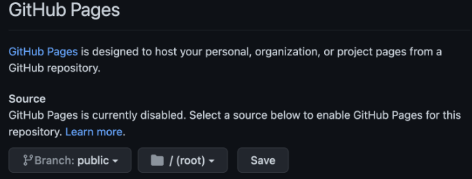
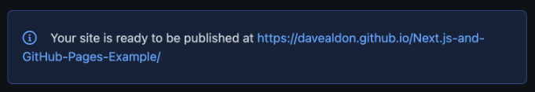
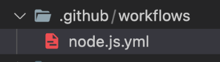
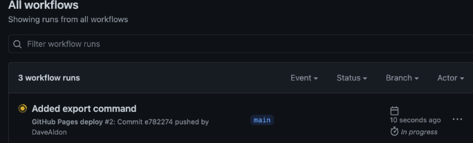
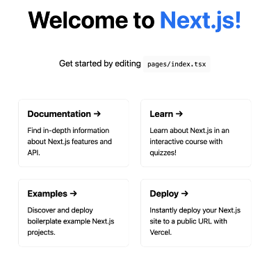

## Deploying Next.js to GitHub Pages

[](https://img.shields.io/badge/made%20with-typescript-blue)


Next.js is a React framework that lets us build React web applications through a layer of automatic configuration abstraction. It pushes the React component paradigm towards a page based structure, and is great for static and, through [automatic static optimization](https://nextjs.org/docs/advanced-features/automatic-static-optimization), dynamic websites. It’s one of the fastest growing frameworks since its inception in 2016, and with good reason. It’s used by **Hulu**, **TikTok**, and **Twitch**, to name a few. Next.js is easy to get into using its own [getting started guide](https://nextjs.org/docs/getting-started), however in this example we’re interested in getting a Next.js website deployed to **GitHub Pages**. 

I’m going to share my lessons learned and what they ***don’t*** tell you about the deployment process. In the end, you’ll have a public website hosted for **free** by GitHub, and built with React and Next.js. Let’s go through the process step-by-step.

#### Step 1: The Next.js project
Follow the official Next.js [getting started guide](https://nextjs.org/docs/getting-started) up until the point where you can run the build and view the compiled website locally. Then change the following:

1. Add this command to your **package.json** file:
```json
"export": "next export"
```


2. Change the **next.config.js** file to **next.config.mjs**, and replace everything inside with the following:
```js
/**
* @type {import('next').NextConfig}
*/
const nextConfig = {
  images: {
    loader: 'akamai',
    path: '',
  },
  assetPrefix: './',
};

export default nextConfig;
```

The extension change is so that the compiler can understand exports, and the update we make inside the file solves a couple of problems:

1. Next.js uses its own image optimization, which doesn’t play nicely with GitHub Pages by default. We change this to the **akamai** option which works properly. You can read more about this [here](https://nextjs.org/docs/basic-features/image-optimization)
2. We need to define an **asset prefix** because GitHub uses Jekyll by default to build static pages, and Jekyll ignores all files prefixed with `_` which Next.js uses

#### Step 2: GitHub Repository Setup
GitHub Pages is a great, free service that lets us publish static websites automatically and directly from our own repositories. I love using this service to get projects running in a “production” environment, which lets us get proof-of-concepts into the hands of users super fast.

Add a new branch with any name you want. I’m using the name “public” in this example. Then, go to your repository **Settings**, then **Pages**, then add the public branch as the source. Make sure the root folder is also selected, and then hit **Save**.



After this, your page will build, and GitHub will share the public URL that you will use to reach the site.



#### Step 3: GitHub Actions
Your website won’t show anything yet, because GitHub doesn’t know that your repository needs to be compiled. This can be handled automatically using GitHub actions, which has free continuous integration minutes we can leverage. We’re going to use a premade GitHub action from the marketplace that contains all the code needed to do this.

Create a **workflows** folder inside your **.github** folder, and inside this new folder create a `.yml` file. The name can be whatever you like.



Inside this file will be the commands that GitHub actions will run. You can [copy my example here](https://github.com/DaveAldon/Next.js-and-GitHub-Pages-Example/blob/main/.github/workflows/node.js.yml) or below:

```yml
# This workflow will do a clean install of node dependencies, build the source code and run tests across different versions of node
# For more information see: https://help.github.com/actions/language-and-framework-guides/using-nodejs-with-github-actions

name: GitHub Pages deploy

on:
  push:
    branches: [main]

jobs:
  build:
    runs-on: ubuntu-latest

    steps:
      - name: Checkout 🛎️
        uses: actions/checkout@v2.3.1
      - name: Use Node.js 16.x
        uses: actions/setup-node@v1
        with:
          node-version: '16.x'

      - name: Installing my packages
        run: npm ci

      - name: Build my App
        run: npm run build && npm run export && touch ./out/.nojekyll

      - name: Deploy 🚀
        uses: JamesIves/github-pages-deploy-action@v4.4.1
        with:
          GITHUB_TOKEN: ${{ secrets.GITHUB_TOKEN }}
          BRANCH: public # The branch the action will deploy to
          FOLDER: out # The folder the action will deploy to
```

Once you commit these files, the actions tab for your repository will show your action running. Actions are triggered automatically after any commits by default.



Once your action has finished building, you can navigate to the URL GitHub created for your repository. If everything worked, and the actions completed successfully, you’ll see a screen like this:



Congratulations! You’ve successfully deployed a Next.js web application to GitHub Pages! If you’d like to see a full project, this repository contains the absolute minimum files needed to work.

If you want to see this repository’s deployment in action, you can visit the website [here](https://davealdon.github.io/Next.js-and-GitHub-Pages-Example/).

### Troubleshooting

#### Fork problems

If you're forking this repo and you're having problems getting the action to run, or your Github pages is only serving the readme instead of the generated website, make sure you're doing the following:

1. When you create a fork, make sure to UNCHECK the **Copy the main branch only** checkbox. You need both branches out of the box
2. Make sure that the `public` branch is not a clone of `main`, but instead contain the build output of the Github action

#### Issues starting from scratch

If you want to implement this workflow on your own without forking, and you want to know how to setup the `public` branch so that it's not a clone of `main`, make sure you're doing the following:

1. Create the `public` branch based on main, it's ok that it's a copy of this branch right now
2. Turn Github pages on (if it was on before you create the branch, turn it off, re-create the `public` branch, and turn it on)
3. Run the Github action via a commit trigger or manually

The Github action requires Github pages to be on, which in turn requires the `public` branch. The Github action will overwrite everything in the `public` branch if it runs successfully.
